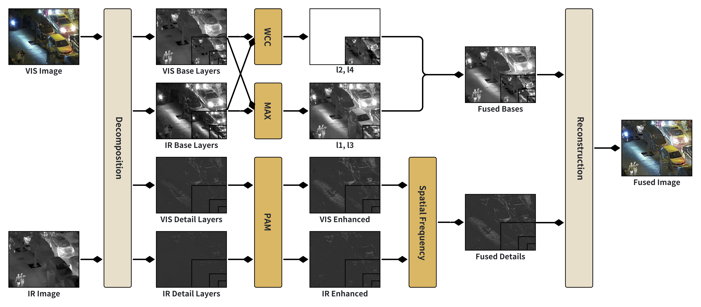
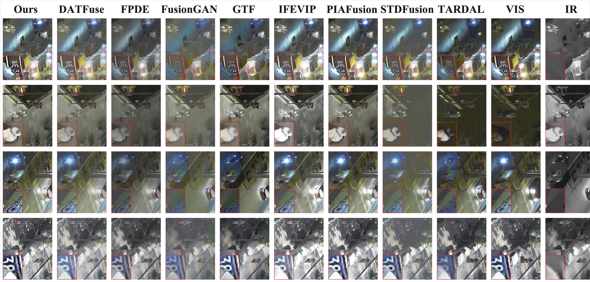

# CPFusion: Enhanced Infrared and Visible Image Fusion via Correlation-Driven Rules and Parameter-Free Attention Mechanism

## 1. Introduction

Infrared and visible image fusion (IVIF) aims to integrate salient targets and detailed information into a single image suitable for both human perception and machine processing. However, many existing methods rely on human-designed fusion rules, which lack interpretability and often fail to effectively enhance detail parts. To address these issues, we propose an IVIF method based on correlation-driven fusion rules and a parameter-free attention module. This method retains valid information across layers and modalities, with fusion weights derived from cross-modal feature map correlations, enhancing robustness. We also introduce a parameter-free attention module to adaptively enhance texture details without additional trainable parameters. Experimental results on public datasets demonstrate the superiority of our method in detail retention and target highlighting, with quantitative evaluations showing improvements in metrics such as average gradient (AG) and Visual Information Fidelity (VIF) by up to 12\% and 18\% respectively, compared to state-of-the-art methods on the LLVIP dataset. Code: This is the official repository.

## 2. Method

This section details our proposed infrared and visible image fusion method shown in Figure. We first decompose input images into base and detail layers using Gaussian filtering. Our method then performs global saliency enhancement on the detail layer. Subsequently, the base and detail layers are fused using an adaptive correlation coefficient-driven fusion weighting strategy, which leverages the adaptive correlation coefficient to derive the final base and detail layers, respectively. Ultimately, the final fused image is obtained through image reconstruction.



## 3. Results

Qualitative fusion results obtained by the proposed method and the compared methods on the TNO dataset.


Qualitative fusion results obtained by the proposed method and the compared methods on the LLVIP dataset.



## 4. Installation

In this project, we use `uv` as the package manager. The offical website is [uv](https://docs.astral.sh/uv/). Also, I developed my own CV utils library [cslib](https://github.com/charlesshan-hub/cslib). You can install the `cslib` and other required libraries by:

```bash
uv init
uv sync
```

If you need update libraries, you can run:

```bash
uv lock --upgrade
uv sync
```

They are defined in the `pyproject.toml` file as below:

```toml
dependencies = [
    "torch>=2.0.0",
    "torchvision",
    "torchmetrics",
    "tensorboard",
    "kornia",
    "seaborn",
    "albumentations",
    "click",
    "einops",
    "pycocotools",
    "scikit-image",
    "scikit-learn",
    "tqdm",
    "timm",
    "wandb",
    "visdom",
    "matplotlib",
    "cslib>0.2"
]
```

## 5. Run

Notes:

* The `assets` folder is used to store the the framework image.
* The `cpfusion` folder is used to store the source code of our method.
* The `samples` folder is used to store the bash scripts to run the inference and dataset.
* The `data` folder is used to store the input and output images.

First change the `inference.sh` file to make it executable.

```bash
#!/bin/bash

PYTHON_SCRIPT="./cpfusion/inference.py"

python $PYTHON_SCRIPT \
    --ir_path "./data/ir/190015.jpg" \
    --vis_path "./data/vis/190015.jpg"
```

Then run the script.

```bash
kimshan@ROBINMBP ~/P/p/CPFusion (master)> pwd
/Users/kimshan/Public/project/CPFusion
kimshan@ROBINMBP ~/P/p/CPFusion (master)> chmod a+x ./samples/inference.sh
kimshan@ROBINMBP ~/P/p/CPFusion (master)> ./samples/inference.sh
[ CPFusion ] ========== Parameters ==========
[ CPFusion ]            name : CPFusion
[ CPFusion ]         ir_path : ./data/ir/190015.jpg
[ CPFusion ]        vis_path : ./data/vis/190015.jpg
[ CPFusion ]           layer : 4
[ CPFusion ]      msd_method : Laplacian
[ CPFusion ] fusion_strategy : CC+MAX
[ CPFusion ]      pam_module : True
[ CPFusion ]          device : mps
[ CPFusion ] ================================
kimshan@ROBINMBP ~/P/p/CPFusion (master)> 
```


## 6. Acknowledgments

This work is supported by the Research Project of Beijing Municipal Natural Science Foundation(No.BJXZ2021-012-00046).